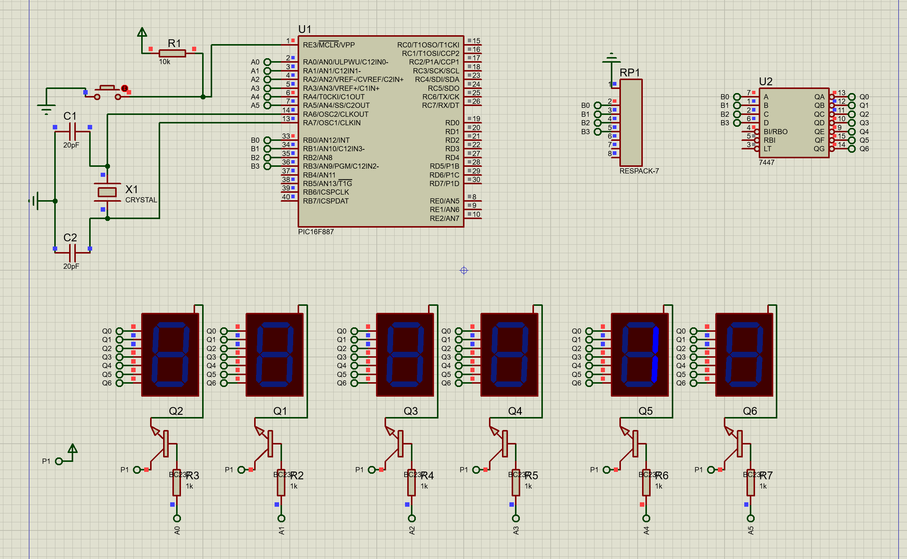

# 6-Digit 7-Segment Display Clock

## Description
This project demonstrates how to control a 6-digit 7-segment display to create a digital clock. The program uses multiplexing to display hours, minutes, and seconds on the 7-segment displays. The clock increments in real-time and resets after reaching 23:59:59.

## Circuit
### 6-Digit 7-Segment Display Setup
  

*Circuit setup for interfacing the 6-digit 7-segment display with the microcontroller.*

## Code Explanation
The program uses multiplexing to display the time on the 6-digit 7-segment display. It extracts the digits for hours, minutes, and seconds, and alternately enables each digit to display the corresponding value.

### Clock Logic
- The clock starts at 12:00:00 and increments every second.
- The `seconds`, `minutes`, and `hours` variables are updated and reset appropriately.
- The `Delay_ms(100)` function ensures the clock updates every 100 milliseconds.

## Files
- `clock_7-seg_multiplexes_&_decodeur_7447.pdsprj`: Circuit schematic for the 6-digit 7-segment display.
- `clock.c`: MikroC program for controlling the 6-digit 7-segment display clock.

## Instructions
- Open `clock_7-seg_multiplexes_&_decodeur_7447.pdsprj` in Proteus to view the circuit design.
- Compile `clock.c` in MikroC to generate the hex file.
- Upload the hex file to the microcontroller in Proteus.
- Simulate the circuit and observe the clock incrementing on the 6-digit 7-segment display.

## Tools
- MikroC Pro for PIC
- Proteus 8 Professional
